## 1. Áttekintés
A rendszer célja egy Webes felülettel rendelkező elektronikus órarend tervező létrehozása. Ezen felületen a regisztrált felhasználók megtervezhetik a saját órarendjüket, új tárgyakat vehetnek fel a rendszerbe,meglévő tárgyakat törölhetnek, szerkeszthetik a meglévő tárgyakat és módosíthatják ezek adatait. Regisztráció nékül ezen funkciók nem elérhetőek, a felhasználó csak betekintést kap a weboldalra. A weblap része lesz egy felhasználó kezelő rendszer, ahol három különböző szint lesz, ezek a vendég, felhasználó és az admin. A weblap teljes mértékben ingyenes lesz, nincs semmi tartalom vagy extra funkció amiért fizetni kellene. 

## 2. Jelenlegi helyzet

A megrendelő szeretné jobban elérhetővé tenni a felhasználók órarendjének megtekintésést, tárolásást.
A megrendelő számára kiemelten fontos, hogy az oldal könnyen kezelhető és áttekinthető legyen. Ezért kért fel minket, hogy készítsünk számára egy weblapot, egy virtuális teret amely ezt a szándékát segíti.
A teret egy online órarend formájában szeretné megvalósítani.
Azt szeretné, ha az egyetemeken előforduló rengeteg tanórát egy helyre gyűjtenénk össze megspórolva rengeteg időt azoknak akik egyesével szeretnék leírni az órájuk összes információját.
Az interneten már találni ehhez hasonló alkalmazásokat, blogokat de azt szeretné ha ez egy ingyenesen használható biztonságosabb hellyé válna olyan szempontból, hogy nem tűnnek el az adatok.
Lehetőséget akar biztosítani, hogy az tanulók minden publikus információt megtudjanak tanáraikról, segítve ezzel a minél szélesebb tudás elsajátítását. A megrendelő felismerte azt, hogy manapság az embereknek szinte mindig van internetelérésük és eszközük ennek használatára.
Ezt megragadva kérte, hogy készítsünk el egy olyan weblapot, ahol bármikor megtekinthetik órarendjüket és tanáruk elérhetőségeit.

## 3. Követelménylista

1. Bejelentkezési felület:
 * A felhasználók ezen a felületen tudnak bejelentkezni a weboldalra a bővebb elérhetőség érdekében.
2. Regisztrációs felület:
 * A felhasználók ezen a felületen tudnak beregisztrálni a weboldalra.
3. Órarend menüpont:
 * A felhasználók itt érik el a bővebb funkciókat
 * Új tárgyakat tudnak rögzíteni és annak a tárgynak az adatait tudják felvenni.
 * Meglévő tárgyakat tudnak törölni és annak a tárgynak az adatait tudják módosítani
 * A tárgy felvétele és törlése az órarendbe/órarendből is itt történik
 * Ugyanitt valósul meg az órarend megtekintése is
4. Jogosultságok:
 * Admin: Teljes hozzáférése van a weboldalhoz, szerkesztheti, kilistázhatja és törölheti a felhasználók adatait is.
 * Felhasználó: Tud a személyes órarendjében új tárgyakat rögzíteni illetve a tárgy adatait felvenni hozzá, tud tárgyakat törölni, tudja a tárgyainak adatai módosítását, tud tárgyat felvenni az órarendjébe, tud tárgyat törölni az órarendjéből, megtudja tekinteni az órarendjét.
 * Vendég: Csak egy betekintő áll rendelkezésére amikor megnyitja a weblapot.

## 4. Jelenlegi üzleti folyamatok modellje

A mai világban az oktatási intézmények a meghirdetett tárgyakat nagyon rugalmasan kezelik, ezért gyakran változnak a kurzusok időpontjai, helyei és oktatói. Ezt a sok változást nem könnyű papíron vezetni, erre a problémára nyújt megoldást az órarend tervező webes alkalmazás. Könnyen lehet módosítani az órarendet, törölni vagy hozzáadni új kurzusokat.

## 5. Igényelt üzleti folyamatok modellje
    5.1 Bejelentkezés
        5.1.1 Órarend menüpont 
                5.1.1.1 Új tárgy rögzítése
                     5.1.1.1.1 Tárgy adatainak felvétele
                5.1.1.2 Tárgy felvétele az órarendbe
                5.1.1.3 Tárgy törlése az órarendből
                5.1.1.4 Órarend megtekintése
        Admin joggal rendelkezőknek:
        5.1.2 Felhasználók szerkesztése
        5.1.3 Felhasználók listázása
        5.1.4 Felhasználók törlése
        5.1. Kijelentkezés
    5.2 Regisztráció

## 6. Használati esetek

Admin: 
Az admin hozzáfér a felhasználók teljes listájához, amely felhasználónevet, e-mail címet és jogkört tartalmaz. Ezen kívül a felhasználók listájában tudja szerkeszteni a felhasználó adatait, illetve tudja törölni az egyes felhasználókat.
Felhasználó: 
A felhasználó megtekintheti a saját órarendjét, ezen kívül tud felvenni új tárgyakat, ahhoz tud tárgy adatokat felvenni. A felvett tárgyakat tudja törölni. Az órarendbe ezeket a felvett tárgyakat be tudja helyezni illetve tudja azt a saját órarendjéből törölni is. Ugyanitt tudja a felvett tárgyaknak az adatait szerkeszteni is. 

## 7. Képernyőterv
 
 Főoldalterv:
 
 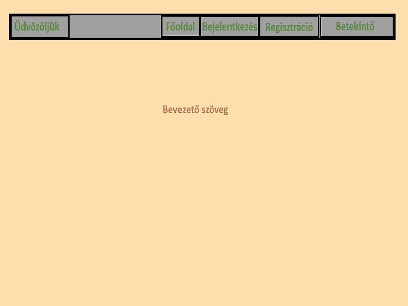

  Főoldalterv-belépés:
 
 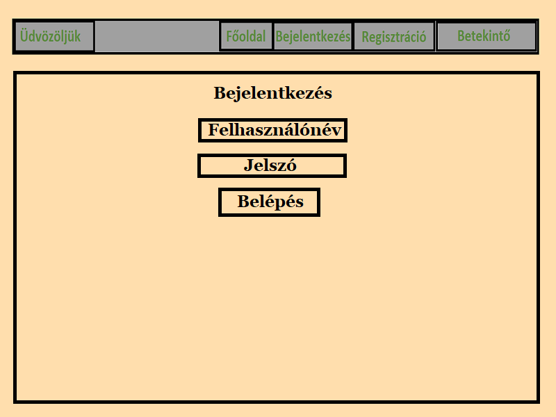

  Főoldalterv-regisztráció:
 
 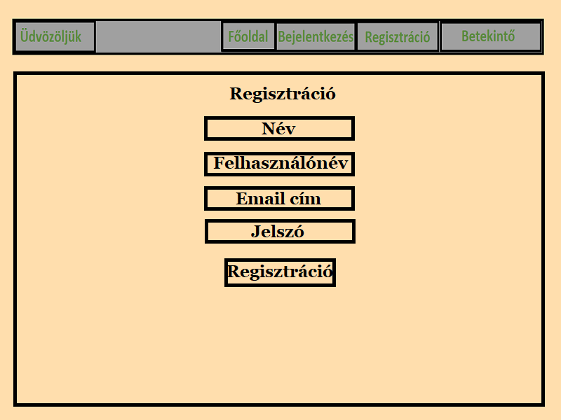
 
 Bejelentkezés utáni főoldal (user):
 
 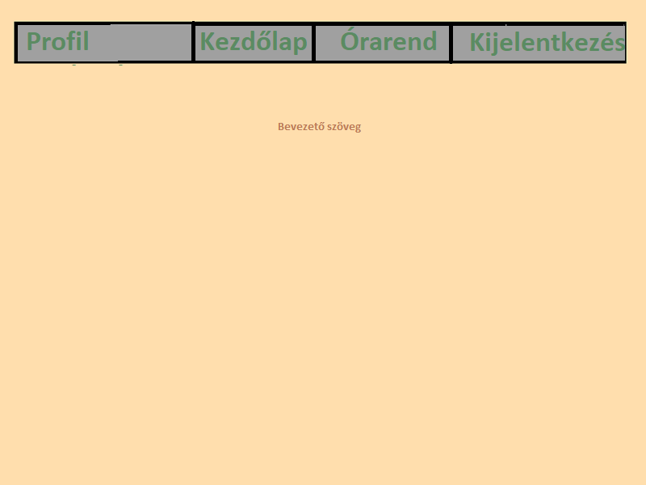

  Bejelentkezés utáni főoldal (user) kurzor az "Órarend" menüponton:
 
 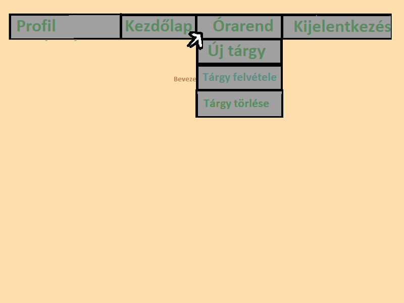
 
   Órarend megjelenítése:
 
 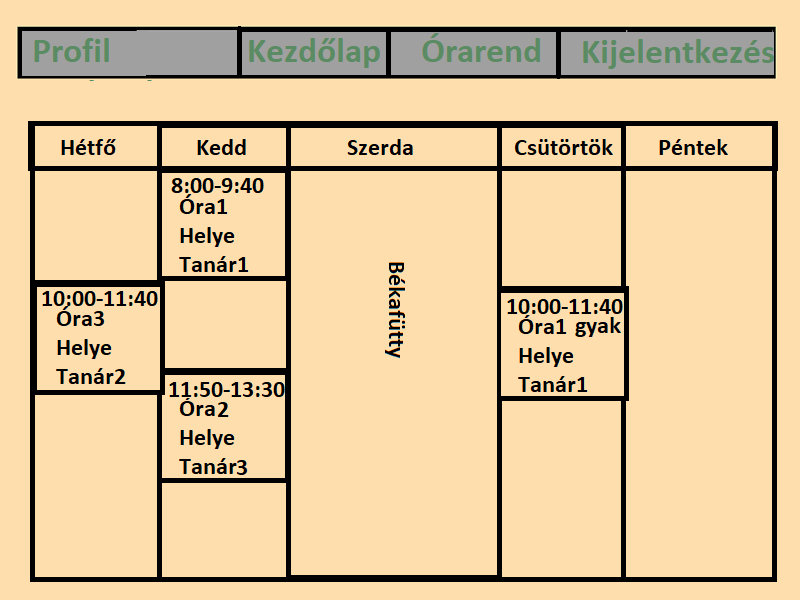

 Bejelentkezés utáni főoldal (admin):
 
 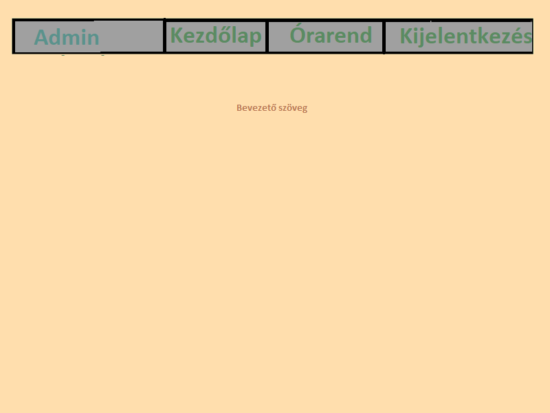
 
 Óra rögzítése az adatbázisba:
 
 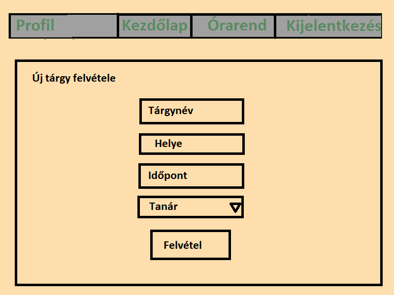

 Óra hozzáadása az órarendhez menüpont:
 
 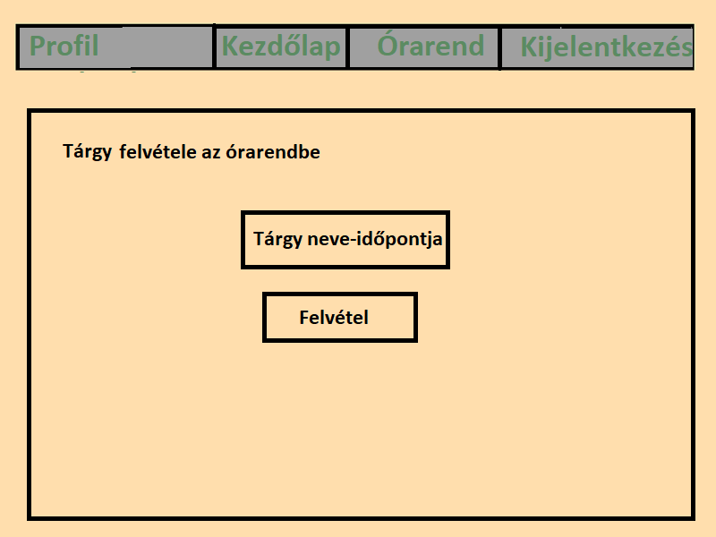

 Óra törlése menüpont:
 
 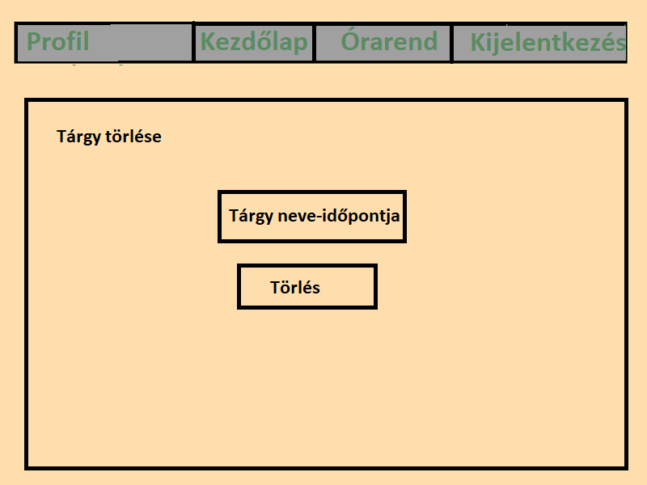

   Óra szerkesztése:
 
 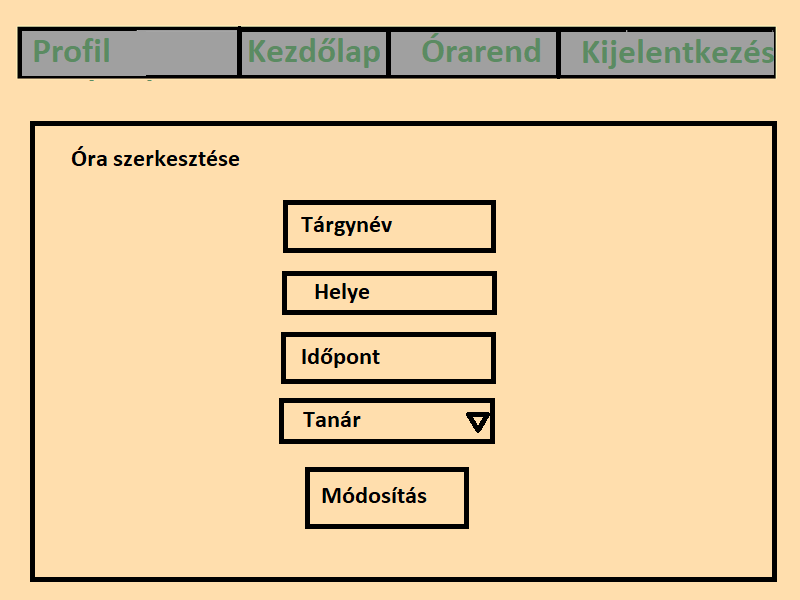
 
 Felhasználók szerkesztése (admin):
 
 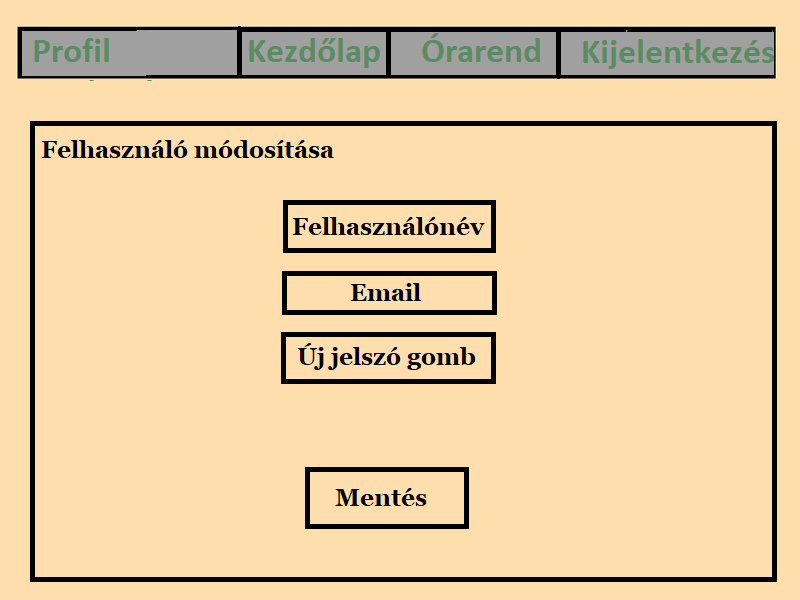
 
 Admin:
 
 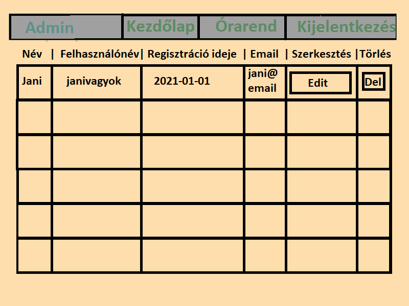

## 8. Forgatókönyv

 A program nem kíván különösebb telepítési és használati útmutatót. Elég, ha egy grafikus felülettel rendelkező webböngésző fel van telepítve ( alapértelmezett: windows - internet explorer / edge, linux: mozilla, mac - safari ). A felhasználó beüti az oldal címét: xyz.com a böngésző címsorába és rögtön át lesz irányítva az oldalra. Az oldal tartalmát a webszerver szolgáltatja a mögötte lévő adatbázis segítségével. Az oldalra átírányítva a felhasználó megkezdheti a saját órarendjének összeállítását ha regisztrált az oldalra, majd bejelentkezett. Ha a felhasználónak bármi nemű problémája akad az oldal működésével kapcsolatban, akkor a megadott elérhetőségek alapján tudja ezt jelezni az oldal karbantartói felé.
 Az oldal adminisztrátorai moderálják az oldalra nem illő tartalmakat a megfelelő eszközök segítségével.
 Az oldal karbantartásáért felelős csapat pedig az oldal rendeltetésének megfelelő működését ellenőrzi és javítja a felmerülő problémákat.

## 9. Fogalomszótár
- **UML** - Unified Modeling Language
- **Reszponzív felület** - Mobilon, Tableten, PC-n igazodik a
képernyőhöz a felület mérete, azaz több eszközön is probléma nélkül
üzemelhet
- **Corrective Maintenance:** A felhasználók által felfedezett és "user reportban"
elküldött hibák kijavítása.
- **Adaptive Maintenance:** A program naprakészen tartása és finomhangolása.
- **Perfective Maintenance:** A szoftver hosszútávú használata érdekében végzett
módosítások, új funkciók, a szoftver teljesítményének és működési
megbízhatóságának javítása.
- **Preventive Maintenance:** Olyan problémák elhárítása, amelyek még nem
tűnnek fontosnak, de később komoly problémákat okozhatnak.