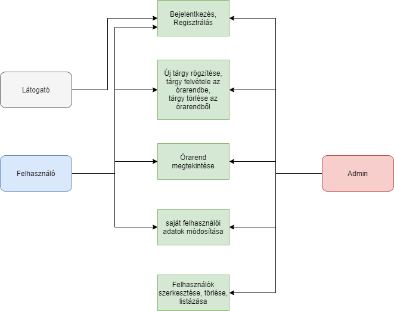
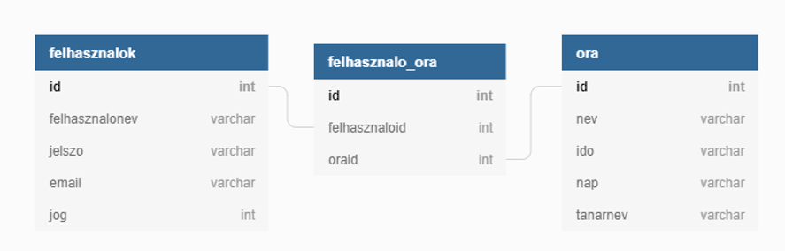

## 1. Rendszer célja
A rendszer célja egy Webes felülettel rendelkező elektronikus órarend tervező létrehozása.
Ezen felületen a regisztrált felhasználók megtervezhetik a saját órarendjüket, új tárgyakat vehetnek fel a rendszerbe,meglévő tárgyakat törölhetnek, szerkeszthetik a meglévő tárgyakat és módosíthatják ezek adatait.
Regisztráció nékül ezen funkciók nem elérhetőek, a felhasználó csak betekintést kap a weboldalra.
A weblap része lesz egy felhasználó kezelő rendszer, ahol három különböző szint lesz, ezek a vendég, felhasználó és az admin.
A weblap teljes mértékben ingyenes lesz, nincs semmi tartalom vagy extra funkció amiért fizetni kellene.
## 2. Projektterv
### Projekttszerepkörök:
  * Termék tulajdonos: WIP csapat
### Projekttmunkások és felelősségek:
  * Backend munkálatok: Csapat tagjai
  * Frontend munkálatok: Csapat tagjai

### Feladatuk: 
- adatbázis létrehozása az adatok tárolásához
- megfelelő funkciók elkészítése az oldal megfelelő működésének érdekében
- felhasználói felület kialakítása
- felhasználókezelés alkalmazása.

### Ütemterv:
 - Követelmény specifikáció
 - Funkcionális specifikáció
 - Rendszerterv
 - Adatbázis kialakítása
 - Felhasználókezelés megvalósítása
 - Backend funkciók elkészítése
 - Frontend design megtervezése
 - Felhasználói felület kialakítása

## 3. Üzleti folyamatok modellje



## 4. Követelmények

**Funkcionális követelmények**
  - **Felhasználók adatainak tárolása**
  - **Felhasználók tudják változtatni adataikat**
  - **Felhasználók órarendjének tárolása**
  - **Tárgyak tárolása**
  - **Tárgyakhoz tartozó adatok tárolása**
  - **Adminisztrátor tudja szerkeszteni a tárgyak adatait és a felhasználók adatait**

  **Nem funkcionális követelmények**
  - **A felhasználók nem férnek hozzá egymás adataihoz**
  - **A felhasználók nem férnek hozzá az admin felülethet**

  **Törvényi előírások, szabványok:**
  - **GDPR-nek való megfelelés**

## 5. Funkcionális terv

**Rendszerszereplők:**
  - **Adminisztrátor**
  - **Felhasználó**
  - **Vendég**

  **Rendszerhasználati esetek és lefutásaik:**
  - **Adminisztrátor**
    - **Képes felhasználókat törölni**
    - **Tudja módosítani a felhasználók jelszavát és adatait is**
    - **Látja az összes regisztrált felhasználót**
    - **Módosítani tudja a tárgyakat, azok adatait**
    - **Teljes hozzáférése van a rendszerhez**
  - **Felhasználó**
    - **Megtekintheti a tárgyait**
    - **Megtekintheti az órarendjét**
    - **Felvehet új tárgyakat az órarendjébe**
    - **Törölhet tárgyakat az órarendjéből**
    - **Új tárgyakat tud felvenni**
    - **Tárgyakat tud törölni**
    - **Felvett tárgyainak tudja az adatait módosítani**
    - **Módosíthatja a saját adatait**
    - **Módosíthatja jelszavát**
  - **Vendég**
    - **Láthat egy generált órarendet minta képpen**
    - **Képes regisztrálni és bejelentkezni**

  - **Menü-hierarchiák:**
    - **Bejelentkezés**
    - **Regisztráció**
    - **Betekintő**

    - **Bejelentkezés után:**
      - **Felhasználók listája:** kizárólag admin joggal rendelkező felhasználóknak
        - **Felhasználó adatainak módosítása**
        - **Felhasználók törlése**

      - **Profil**
      - **Órarend**
      - **Új tárgy felvétele**
        - **Tárgy felvétele az órarendbe**
        - **Tárgy törlése az órarendből**
      - **Kijelentkezés**

## 6. Fizikai környezet

- **Az alkalmazás csak web platformra készül, AWS EC2 instance-ra telepített Apache szerveren, MySQL adatbázissal lesz futtatva.**
  - **Nincsenek megvásárolt komponensek.**
  - **Fejlesztői eszközök:**
    - **Visual Studio Code**
    - **Notepad++**
    - **Sublime text 3**
    - **MySQL Workbench**
    - **HeidiSQL**

## 7. Architekturális terv

A rendszer tökéletes működéséhez szükség van egy adatbázis szerverre, ebben az esetben MySql-t használunk. A bootstrap mint CSS keretrendszer felel a reszponzív webdesign-ért. A backend php alapú.

## 8. Adatbázis terv
### **Táblák**
- **felhasznalok:** Minden felhasználó, aki az oldalon regisztrált
  - **id:** Azonosító szám, mindenképp felvesz egy egész típusú értéket, amit a rendszer automatikusan generál és egyesével növekszik, nem lehet két azonos szám
  - **felhasznalonev:** A felhasználók regisztrációkor megadott neve, nem lehet üres
  - **jelszo:** Nem lehet üres a mező, legalább 8 karakter
  - **email:** Egyedi, tehát nem lehet két felhasználónak ugyanazon email címe és egyben nem lehet üres mező
  - **jog:** Egész érték, nem lehet üres mező 


- **ora:**
  - **id:** Minden óra egyedi azanosítóval bír, automatikusan növekszik és nem lehet üres mező
  - **nev:** Az óra neve, nem lehet üres mező
  - **ido:** Az óra időpontja, nem lehet üres mező
  - **nap:** Az óra napja, egész típusú, 1-5 közötti értékeket vehet fel
  - **tanarnev:** Az óraadó tanár neve

- **orarend:**
  - **id:** Az adott órarend azonosítója, nem lehet üres és automatikusan növekszik
  - **felhasznaloid:** A felhasználó id-je, nem lehet null
  - **oraid:** Az adott óra id-je, nem lehet null

**DSL**
```
Table "felhasznalok" {
  "id" int(11) [pk, not null, increment]
  "felhasznalonev" varchar(65) [not null]
  "jelszo" varchar(65) [not null]
  "email" varchar(65) [not null]
  "jog" int(11) [not null]

Indexes {
  email [unique, name: "email"]
}
CONSTRAINT fk_felhasznaloid FOREIGN KEY(id) REFERENCES orarend(felhasznaloid)
}

Table "ora" {
  "id" int(11) [pk, not null, increment]
  "nev" varchar(255) [not null]
  "ido" varchar(65) [not null]
  "nap" varchar(65) [not null]
  "tanarnev" varchar(65) [not null]

  CONSTRAINT fk_oraid FOREIGN KEY(id) REFERENCES orarend(oraid)
}

Table "orarend" {
  "id" int(11) [pk, not null, increment]
  "felhasznaloid" int(11) [not null]
  "oraid" int(11) [not null] 
}

```
**UML**



## 9. Implementációs terv

A webes felület HTML, CSS és PHP nyelven fog elkészülni. A különböző technológiákat amennyire csak lehet, külön fájlokba írva készítjük el, úgy csatoljuk egymáshoz ezzel is egy átláthatóbb, könnyebben változtatható és bővíthető weboldal lesz. Az adatokat egy MYSQL adatbázisban fogjuk tárolni.

## 10. Tesztterv

Az alább leírt tesztelések célja a rendszer és funkcióinak teljes körű vizsgálata, ellenőrzése.

Gombok, linkek tesztelése: tesztünk célja: a weboldalon megjelenő gombok és linkek megfelelő működésének ellenőrzése.
Adatrögzítések leeleenőrzése, hogy sikeresen feltöltődtek-e az adatbázisba. 
Adatok betöltése az adatbázisból.
Műveletek tesztelése: Törlés, módosítás, hozzáadás.
A jelszavakkal biztonságos tárolásának ellenőrzése.
Hibás, hiányos adatok esetén adott hibaüzenetek ellenőrzése.
A weboldal helyes működésének letesztelése különböző böngészőkben például Microsoft Edge, Google Chrome, Firefox…

## 11. Telepítési terv

A szoftver webes felületéhez csak egy böngésző telepítése szükséges.
* Windows - Microsoft Edge
* Linux - Mozilla Firefox
* Mac - Safari

A webszerverre közvetlenül az internetről kapcsolódnak rá a kliensek.
A weboldal URL címét szükséges ismerni és ezt beírni a böngésző címsorába.

## 12. Karbantartási terv

A felhasználók egy report formájában tudják jelenteni a felmerűlő funkcionális hibákat az adminok felé, amit a fejlesztők fognak kijavítani.
A javított hibák egy oldalon Changelog vagy hír formában meg fognak jelenni visszajelzésként a felhasználók felé, az új funkciók / frissítésekkel együtt.
A karbantartási időkről a felhasználókat egy e-mail formájában előre tájékoztatjuk.
